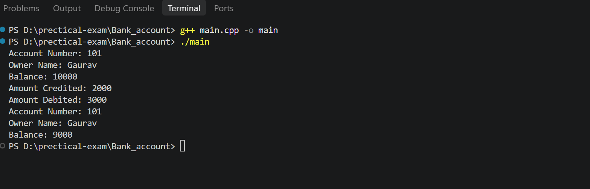

# Bank Account Management System

## 📌 Description

This is a simple **C++ Bank Account Management System** program.

The program demonstrates basic **Object-Oriented Programming (OOP)** concepts such as:

* Class and Object
* Constructor
* Encapsulation
* Private data members
* Member functions
* Credit (Deposit)
* Debit (Withdraw)
* Balance checking

---

## 🛠️ Technologies Used

* C++
* iostream
* Object-Oriented Programming (OOP)
* visual studio / github


---

## 📂 Folder Structure

```text
Bank_account
│
├── main.cpp
├──output.png
└── README.md
```
## output


---

## ⚙️ Features

### 1. Create Bank Account

The program creates a bank account using:

* Account Number
* Owner Name
* Initial Balance

### 2. Credit Amount

The `credit()` function adds money to the account balance.

### 3. Debit Amount

The `debit()` function withdraws money from the account.

If the withdrawal amount is greater than the available balance, it displays:

```text
Insufficient Balance
```

### 4. Display Account Details

The `displayBalance()` function displays:

* Account Number
* Owner Name
* Current Balance

---

## 💻 Example

```cpp
BankAccount b1(101, "Gaurav", 10000);
```

This creates an account with:

```text
Account Number: 101
Owner Name: Gaurav
Balance: 10000
```

Then:

```cpp
b1.credit(2000);
```

adds ₹2000.

And:

```cpp
b1.debit(3000);
```

withdraws ₹3000.

---

## ▶️ Sample Output

```text
Account Number: 101
Owner Name: Gaurav
Balance: 10000

Amount Credited: 2000
Amount Debited: 3000

Account Number: 101
Owner Name: Gaurav
Balance: 9000
```

---

## 🧠 OOP Concepts Used

### Class

`BankAccount` is the class that contains account data and functions.

### Object

```cpp
BankAccount b1(101, "Gaurav", 10000);
```

`b1` is an object of the `BankAccount` class.

### Encapsulation

The account information is kept private:

```cpp
private:
    int accountNumber;
    double balance;
    string ownerName;
```

The data is accessed through public functions like:

```cpp
credit()
debit()
displayBalance()
```

### Constructor

The constructor initializes the account details:

```cpp
BankAccount(int acc, string name, double bal)
```

---

## 🚀 How to Run

### Step 1

Save the program as:

```text
main.cpp
```

### Step 2

Compile the program:

```bash
g++ main.cpp -o main
```

### Step 3

Run the program:

```bash
./main
```

---

## 👨‍💻 Author

**Gaurav Pipavat**

C++ OOP Practice Project
