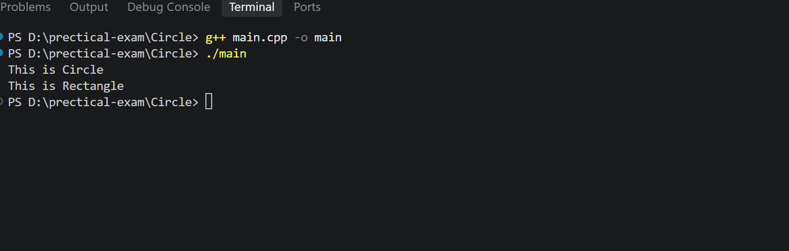

# Shape Hierarchy - Polymorphism

## 📌 Description

This is a simple C++ program that demonstrates **Runtime Polymorphism** using a base class `Shape` and two derived classes:

* Circle
* Rectangle

The program uses a virtual function called `displayDetails()`.

## 🛠️ Concepts Used

* C++
* Object-Oriented Programming (OOP)
* Inheritance
* Polymorphism
* Virtual Function
* Function Overriding
* Base Class Pointer
* visual studio / github

## 📂 Folder Structure

```text
Circle
│
├── main.cpp
├──output.png
└── README.md
```

## output


## 🧩 Classes

### Shape

`Shape` is the base class.

It contains the virtual function `displayDetails()`.

### Circle

`Circle` inherits from the `Shape` class and overrides the `displayDetails()` function.

### Rectangle

`Rectangle` inherits from the `Shape` class and overrides the `displayDetails()` function.

## 🔄 Polymorphism

The program creates an array of `Shape` pointers.

The pointers point to objects of both `Circle` and `Rectangle`.

When `displayDetails()` is called using the `Shape` pointer, the appropriate derived class function is executed.

This demonstrates **Runtime Polymorphism**.

## ▶️ Output

```text
This is Circle
This is Rectangle
```

## 📚 OOP Concepts

| Concept             | Description                           |
| ------------------- | ------------------------------------- |
| Class               | Shape, Circle, Rectangle              |
| Inheritance         | Circle and Rectangle inherit Shape    |
| Virtual Function    | displayDetails()                      |
| Function Overriding | Derived classes override the function |
| Polymorphism        | Same function behaves differently     |
| Base Class Pointer  | Points to derived class objects       |

## 🎯 Purpose

The main purpose of this program is to understand **virtual functions, function overriding, inheritance, and runtime polymorphism in C++**.

## 👨‍💻 Author

**Gaurav Pipavat**
