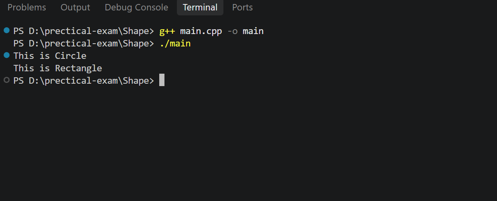

# Shape Hierarchy - Runtime Polymorphism

## 📌 Description

This project demonstrates **Runtime Polymorphism in C++** using a base class `Shape` and two derived classes:

* Circle
* Rectangle

The program uses a **virtual function** `displayDetails()` and a **Shape pointer array** to call the appropriate function of each derived class.

## 🛠️ Concepts Used

* C++
* Object-Oriented Programming
* Inheritance
* Runtime Polymorphism
* Virtual Function
* Function Overriding
* Base Class Pointer

## 📂 Folder Structure

```text
Shape
│
├── main.cpp
├──output.png
└── README.md
```
## output


## 🧩 Classes

### Shape

`Shape` is the base class. It contains the virtual function `displayDetails()`.

### Circle

`Circle` inherits from `Shape` and overrides the `displayDetails()` function.

### Rectangle

`Rectangle` inherits from `Shape` and overrides the `displayDetails()` function.

## 🔄 Polymorphism

The program creates an array of `Shape` pointers.

The pointers point to objects of `Circle` and `Rectangle`.

When `displayDetails()` is called through the `Shape` pointer, C++ executes the corresponding function of the actual object.

This is called **Runtime Polymorphism**.

## ▶️ Output

```text
This is Circle
This is Rectangle
```

## 🚀 How to Run

### Step 1: Open the Project

Open the project folder in **Visual Studio Code** or any C++ IDE.

### Step 2: Open Terminal

Open the terminal inside the project folder.

### Step 3: Compile the Program

```bash
g++ main.cpp -o main
```

### Step 4: Run the Program

**Windows:**

```bash
main.exe
```

**Linux / macOS:**

```bash
./main
```

## 📚 OOP Concepts

| Concept             | Description                               |
| ------------------- | ----------------------------------------- |
| Class               | Shape, Circle, Rectangle                  |
| Inheritance         | Circle and Rectangle inherit Shape        |
| Virtual Function    | displayDetails()                          |
| Function Overriding | Derived classes override displayDetails() |
| Polymorphism        | Same function behaves differently         |
| Base Class Pointer  | Points to derived class objects           |

## 🎯 Purpose

The purpose of this project is to understand how **inheritance, virtual functions, function overriding, and runtime polymorphism** work in C++.

## 👨‍💻 Author

**Gaurav Pipavat**
