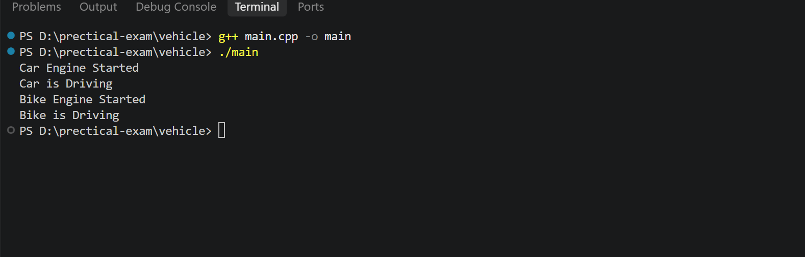

# Vehicle - Abstract Class and Polymorphism

## 📌 Description

This project demonstrates **Abstract Classes and Runtime Polymorphism in C++**.

The program has an abstract base class `Vehicle` and two derived classes:

* Car
* Bike

The `Vehicle` class contains two **pure virtual functions**:

* `startEngine()`
* `drive()`

The `Car` and `Bike` classes implement these functions according to their behavior.

## 🛠️ Concepts Used

* C++
* Object-Oriented Programming
* Abstract Class
* Pure Virtual Function
* Inheritance
* Runtime Polymorphism
* Base Class Pointer
* Function Overriding

## 📂 Folder Structure

```text
vehicle
│
├── main.cpp
├── output.png
└── README.md
```
## output


## 🧩 Classes

### Vehicle

`Vehicle` is an **abstract class**.

It contains two pure virtual functions:

* `startEngine()`
* `drive()`

Because these functions are pure virtual, objects of the `Vehicle` class cannot be created directly.

### Car

`Car` inherits from `Vehicle` and implements:

* `startEngine()`
* `drive()`

### Bike

`Bike` inherits from `Vehicle` and implements:

* `startEngine()`
* `drive()`

## 🔄 Polymorphism

The program creates an array of `Vehicle` pointers.

The pointers point to objects of both `Car` and `Bike`.

When the functions are called using the `Vehicle` pointers, the appropriate `Car` or `Bike` function is executed.

This demonstrates **Runtime Polymorphism**.

## ▶️ Output

```text
Car Engine Started
Car is Driving
Bike Engine Started
Bike is Driving
```

## 🚀 How to Run

### Step 1: Open the Project

Open the project folder in **Visual Studio Code** or any C++ IDE.

### Step 2: Open Terminal

Open the terminal inside the project folder.

### Step 3: Compile the Program

```bash
g++ main.cpp -o main
```

### Step 4: Run the Program

**Windows:**

```bash
main.exe
```

**Linux / macOS:**

```bash
./main
```

## 📚 OOP Concepts

| Concept               | Description                              |
| --------------------- | ---------------------------------------- |
| Abstract Class        | `Vehicle`                                |
| Pure Virtual Function | `startEngine()` and `drive()`            |
| Inheritance           | Car and Bike inherit Vehicle             |
| Polymorphism          | Vehicle pointer calls derived functions  |
| Function Overriding   | Car and Bike implement virtual functions |
| Base Class Pointer    | Points to Car and Bike objects           |

## 🎯 Purpose

The purpose of this project is to understand **abstract classes, pure virtual functions, inheritance, and runtime polymorphism** in C++.

## 👨‍💻 Author

**Gaurav Pipavat**
